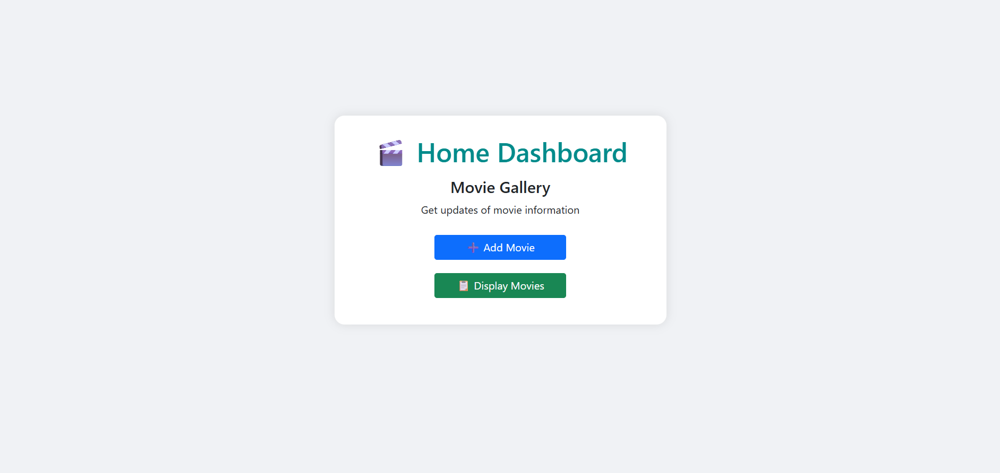
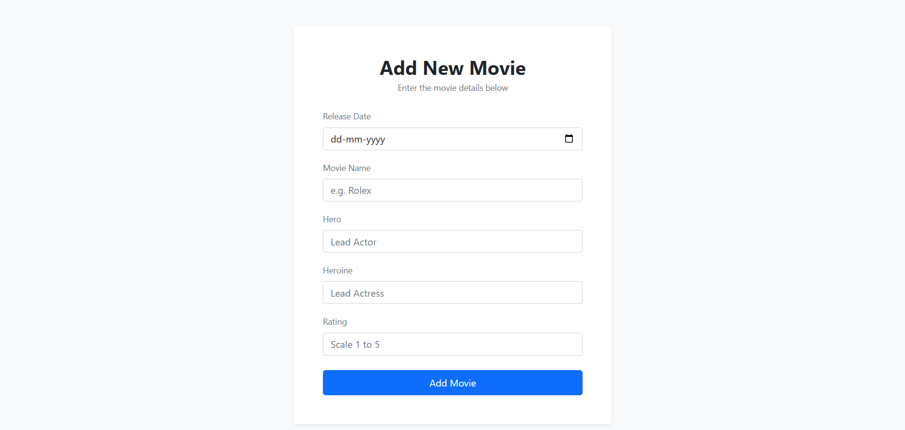
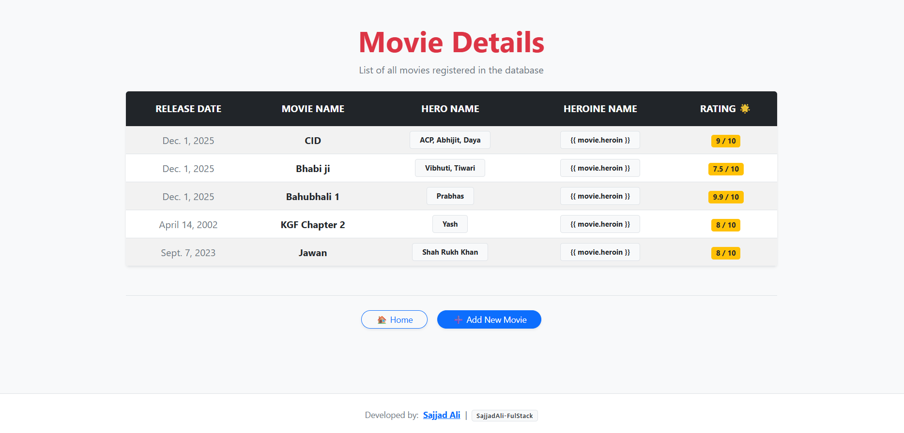

# 🎬 Django Movie App

A simple Django web application for managing movies.  
It includes a dashboard, add movie form, and display page to view all movies.

---

## 🚀 Features

- 🏠 Dashboard (Home Page)
- ➕ Add Movie using Django Forms
- 📃 Display all movies from database
- 🗄️ Uses Django Models & SQLite database
- 🎨 Simple template-based UI

---

## 🛠️ Tech Stack

- Python 🐍
- Django 🌐
- HTML Templates 🧾
- SQLite 🗄️

---

## 📸 Project Screenshots

### 🏠 Dashboard

### ➕ Add Movie Page

### 📃 Display Movies Page

---

## 🤝 Connect With Me

-  
-  
